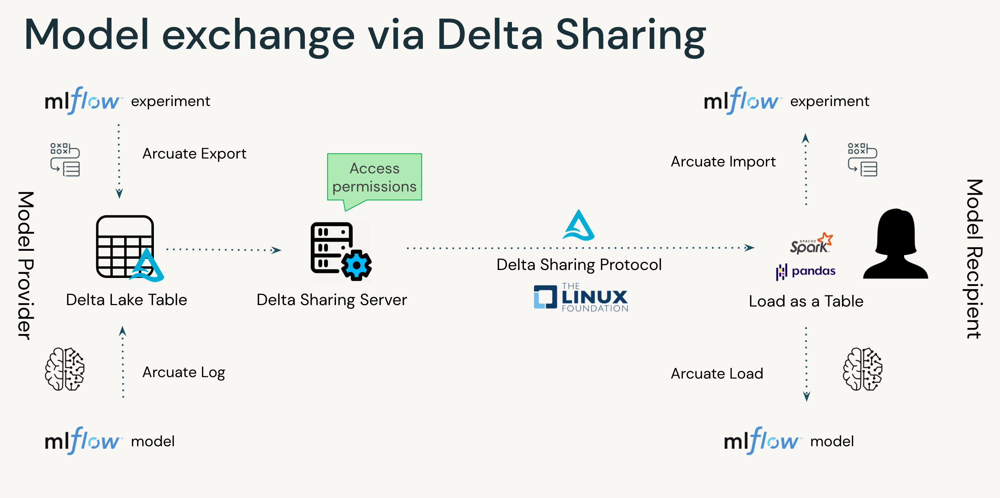

# Arcuate

*Deltas with a triangular or fan shape are called* **arcuate** *(arc-like) deltas. The Nile River forms an arcuate delta as it empties into the Mediterranean Sea.*
___

[]()
[](https://github.com/databricks/arcuate/actions/workflows/pytest.yml)
[](https://github.com/databricks/arcuate/actions/workflows/build.yml)

## Model exchange via Delta Sharing

One of the main drivers for data sharing is the knowledge contained within the data. An alternative for sharing data in highly regulated environments can be sharing of models trained on the sensitive data.

Current options are not fit for purpose

Leveraging experiments & model in MLflow, combining it with Delta to leverage Delta Sharing capabilities to enable models exchange

Using Delta Sharing also allow sharing of relevant metadata such as training parameters, model accuracy, artifacts, etc.

The project name takes inspiration from arcuate delta - the wide fan-shaped river delta. We believe that enabling model exchange will have a wide impact on many digitally connected industries.



## How to use:

Install the library

```python
pip install arcuate
```

- Train model in Databricks (or elsewhere), store it in MLflow
- Export MLflow experiments & models to a Delta table and add it to a share, using IPython magic 
    ```python
    %%arcuate
    CREATE SHARE share_name WITH TABLE table_name FROM EXPERIMENT experiment_name
    ```

    ```python
    %%arcuate
    CREATE SHARE share_name WITH TABLE table_name FROM MODEL model_name
    ```
- Recipient of this shared table can load it into MLflow seamlessly, using IPython magic:
    ```python
    %%arcuate
    CREATE [OR REPLACE] EXPERIMENT experiment_name AS [PANDAS/SPARK] delta_sharing_coordinate
    ```

    ```python
    %%arcuate
    CREATE [OR REPLACE] MODEL model_name AS [PANDAS/SPARK] delta_sharing_coordinate
    ```

- Users who prefer Python API instead of IPython magic can leverage these API calls:

  - On the provider side

    ```python
    import arcuate

    # export the experiment experiment_name to table_name, and add it to share_name
    export_experiments(experiment_name, table_name, share_name)
    
    # export the model model_name to table_name, and add it to share_name
    export_models(model_name, table_name, share_name)    
    ```

  - On the recipient side

    ```python
    import arcuate
    import delta_sharing

    df = delta_sharing.load_as_pandas(delta_sharing_coordinate)
    
    # import the shared table as experiment
    import_experiments(df, experiment_name)
    # or import the model
    import_models(df, model_name)
    ```

## Project support
Please note that all projects in the /databrickslabs github account are provided for your exploration only, and are not formally supported by Databricks with Service Level Agreements (SLAs). They are provided AS-IS and we do not make any guarantees of any kind. Please do not submit a support ticket relating to any issues arising from the use of these projects.

Any issues discovered through the use of this project should be filed as GitHub Issues on the Repo. They will be reviewed as time permits, but there are no formal SLAs for support.

## Authors:
- Vuong Nguyen, Solutions Architect, <vuong.nguyen@databricks.com>
- Milos Colic, Sr. Solutions Architect, <milos.colic@databricks.com>
