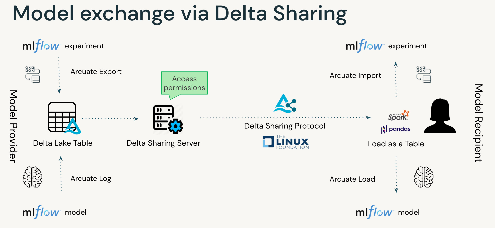

## Mini project 
### Model exchange via Delta Sharing
One of the main drivers for data sharing is the knowledge contained within the data. An alternative for sharing data in highly regulated environments can be sharing of models trained on the sensitive data.
Current options are not fit for purpose

Authors:
- Vuong Nguyen, Solutions Architect, vuong.nguyen@databricks.com
- Milos Colic, Sr. Solutions Architect, milos.colic@databricks.com

Leveraging experiments & model in MLflow, combining it with Delta to leverage Delta Sharing capabilities to enable models exchange

Using Delta Sharing also allow sharing of relevant metadata such as training parameters, model accuracy, artifacts, etc.

E2E workflow:
- Train model in Databricks (or elsewhere), store it in MLflow
- Export MLflow experiments & models to a Delta table and add it to a share
    - `CREATE SHARE share_name WITH TABLE table_name FROM EXPERIMENT experiment_name`
    - `CREATE SHARE share_name WITH TABLE table_name FROM MODEL model_name`
- Recipient of this shared table can load it into MLflow seamlessly: 
    - `CREATE EXPERIMENT [OVERWRITE] experiment_name AS [PANDAS/SPARK] delta_sharing_coordinate`
    - `CREATE MODEL [OVERWRITE] model_name AS [PANDAS/SPARK] delta_sharing_coordinate`