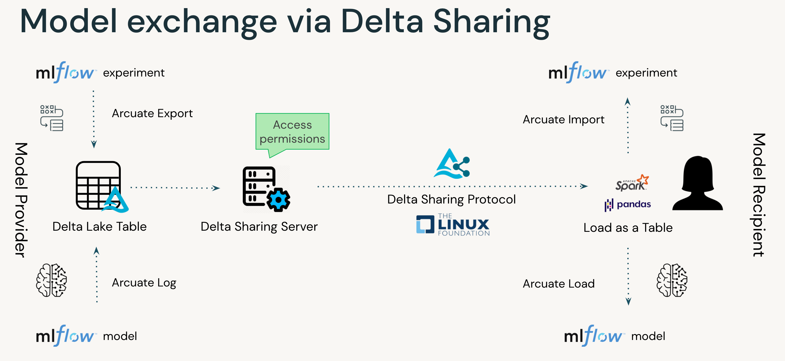

.. Arcuate documentation master file, created by
   sphinx-quickstart on Fri Apr  29 11:01:42 2022.
   You can adapt this file completely to your liking, but it should at least
   contain the root `toctree` directive.

Arcuate is an extension to Delta Sharing that allows exchange of ML models over the Delta Sharing protocol.

Arcuate provides:
   - easy way to share mlflow models;
   - easy way to share mlflow experiments;
   - easy way to ingest mlflow models;
   - easy way to ingest mlflow experiments

Documentation
=============

.. toctree::
   :maxdepth: 1
   :caption: Contents:

   api/provider
   api/recipient

Indices and tables
==================

* :ref:`genindex`
* :ref:`search`

.. * :ref:`modindex`

Project Support
===============

Please note that all projects in the ``databrickslabs`` github space are provided for your exploration only, and are not formally supported by Databricks with Service Level Agreements (SLAs). They are provided AS-IS and we do not make any guarantees of any kind. Please do not submit a support ticket relating to any issues arising from the use of these projects.

Any issues discovered through the use of this project should be filed as GitHub Issues on the Repo. They will be reviewed as time permits, but there are no formal SLAs for support.
